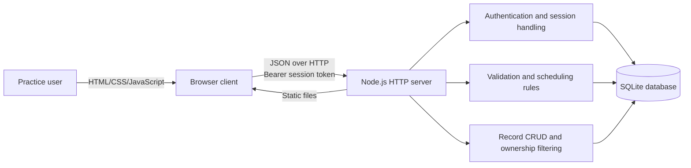

# CareDesk High-Level Design

## 1. Purpose

CareDesk is a small-practice doctor appointment and patient management system. It gives each registered practice account a private workspace for maintaining doctors, patients, and appointments. The current implementation is a zero-runtime-dependency Node.js application with a browser frontend and SQLite persistence.

## 2. System Context

### Actors

- **Practice administrator/owner:** creates an account, signs in, manages the practice directory, schedules visits, and updates appointment status.
- **Demo administrator:** the first bootstrap account, configured through `ADMIN_EMAIL` and `ADMIN_PASSWORD` or the documented local defaults.

Patients and doctors are managed records in this release; they do not sign in directly.

### External dependencies

- A modern web browser.
- Node.js 22.13 or newer.
- The SQLite implementation provided by `node:sqlite`.
- Local filesystem storage for `data/caredesk.sqlite` or a directory supplied through `DATA_DIR`.

The application does not call external APIs and has no third-party runtime packages.

## 3. Architecture

### Presentation layer

`index.html`, `styles.css`, and `app.js` form a responsive single-page interface. The client renders sign-in/sign-up views, dashboards, searchable record tables, and modal forms. It stores only the current bearer token in `sessionStorage`; business records are fetched from the API.

### Application/API layer

`server.js` uses Node's native HTTP server. It serves the three static frontend assets and routes `/api/*` requests. The server owns authentication, authorization, validation, conflict detection, CRUD operations, and JSON error responses.

### Persistence layer

SQLite stores users, session hashes, doctors, patients, and appointments. Foreign keys protect appointment relationships. `ownerId` on every business record enforces private per-account workspaces. The database file is local and excluded from version control.

### Test layer

`test/server.test.js` uses Node's built-in test runner and a temporary database. It starts the real HTTP server on an ephemeral port and tests the API through `fetch`.

## 4. Major Components

| Component | Responsibility |
| --- | --- |
| Static file server | Returns `/`, `/index.html`, `/styles.css`, and `/app.js`; rejects unknown files. |
| Authentication service | Creates accounts, hashes passwords, issues sessions, validates bearer tokens, and logs users out. |
| Workspace authorization | Adds `ownerId` to created records and filters every read, update, and delete by the authenticated user. |
| Doctor management | Creates, lists, edits, and removes doctor directory entries. |
| Patient management | Creates, lists, edits, and removes patient contact, birth date, and notes records. |
| Appointment management | Creates, lists, edits, and removes visits while validating relationships, states, duration, and schedule overlap. |
| Browser state/rendering | Fetches record collections, renders views, handles forms, filters tables, and displays errors/toasts. |
| SQLite datastore | Provides durable local storage, uniqueness for user email, referential integrity, and lookup indexes. |

## 5. Primary Data Flows

### Account creation and sign-in

1. The user submits email and password from the browser.
2. The server normalizes the email and validates email/password constraints.
3. On sign-up, the server generates a UUID and stores a salted PBKDF2 password hash.
4. On sign-up or successful login, the server generates a random session token.
5. Only the SHA-256 hash of the token is stored in SQLite with a seven-day expiration.
6. The raw token is returned once and kept in browser `sessionStorage`.
7. Subsequent API requests send `Authorization: Bearer <token>`.

### Loading a private workspace

1. After authentication, the browser requests doctors, patients, and appointments in parallel.
2. The server resolves the bearer token to a user.
3. Each collection query includes `WHERE ownerId = ?`.
4. The browser receives only records owned by that account and renders the dashboard.

### Creating an appointment

1. The user selects one of their patients and doctors, then supplies date, time, duration, status, and reason.
2. The server verifies that both referenced records belong to the authenticated account.
3. It validates date/time formats, allowed duration, allowed status, and reason length.
4. Unless the appointment is cancelled, the server compares its time interval with the account's existing non-cancelled appointments.
5. A request is rejected if the same doctor or patient has an overlapping interval.
6. A valid appointment is written with the current user's `ownerId`, returned as JSON, and reflected in the refreshed dashboard.

### Protected deletion

1. The server confirms the target belongs to the current account.
2. Before deleting a doctor or patient, it checks for linked appointments owned by that account.
3. Linked records produce HTTP 409; the user must delete the appointments first.
4. Appointments can be deleted directly.

## 6. Deployment Topology

The current topology is one Node.js process and one SQLite file:

- `PORT` selects the HTTP port, defaulting to `3000`.
- `DATA_DIR` selects the database directory, defaulting to `./data`.
- `ADMIN_EMAIL` and `ADMIN_PASSWORD` configure the first bootstrap account before the first database initialization.
- Static assets and API endpoints share the same origin, so no CORS configuration is needed.

For public deployment, the host must support Node.js 22.13+ and persistent disk storage. Multiple stateless replicas are outside the present design because each process would otherwise use a separate SQLite file.

## 7. Quality Attributes

- **Security:** password hashes use PBKDF2-SHA256 with unique salts and 150,000 iterations; session tokens are random and stored only as hashes; ownership checks are server-side.
- **Integrity:** SQLite foreign keys, UUID identifiers, unique user emails, parameterized statements, and linked-record checks protect data relationships.
- **Usability:** responsive navigation, modal forms, search/status filters, dashboard totals, and actionable validation messages support routine practice work.
- **Maintainability:** the system uses a small number of files, native platform APIs, centralized validation, and documented REST resources.
- **Testability:** `DATA_DIR` allows isolated test databases; HTTP-level tests exercise real authentication and persistence logic.

## 8. Constraints and Risks

- SQLite and synchronous queries suit a capstone/small-practice workload, not high-concurrency multi-instance deployment.
- Sessions expire when read but expired rows are not yet periodically purged.
- The bootstrap defaults are intended for local demonstration and must be overridden before real deployment.
- The current server does not provide TLS; production hosting must terminate HTTPS.
- There are no audit logs, password reset, email verification, role-specific permissions, backups, or regulatory compliance controls.
- Clinical notes and real patient data should not be used until the security and privacy controls required by the deployment jurisdiction are implemented.

